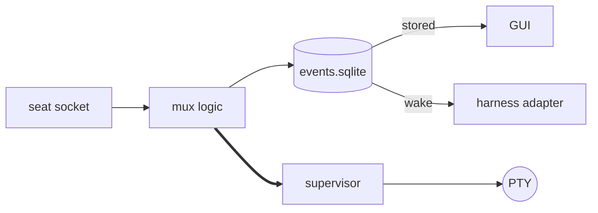

```mermaid
flowchart LR
  seat[seat socket] --> logic[mux logic]
  logic --> bus[(events.sqlite)]
  bus -->|stored| gui[GUI]
  bus -->|wake| harness[harness adapter]
  logic ==> sup[supervisor]
  sup --> pty((PTY))
```
