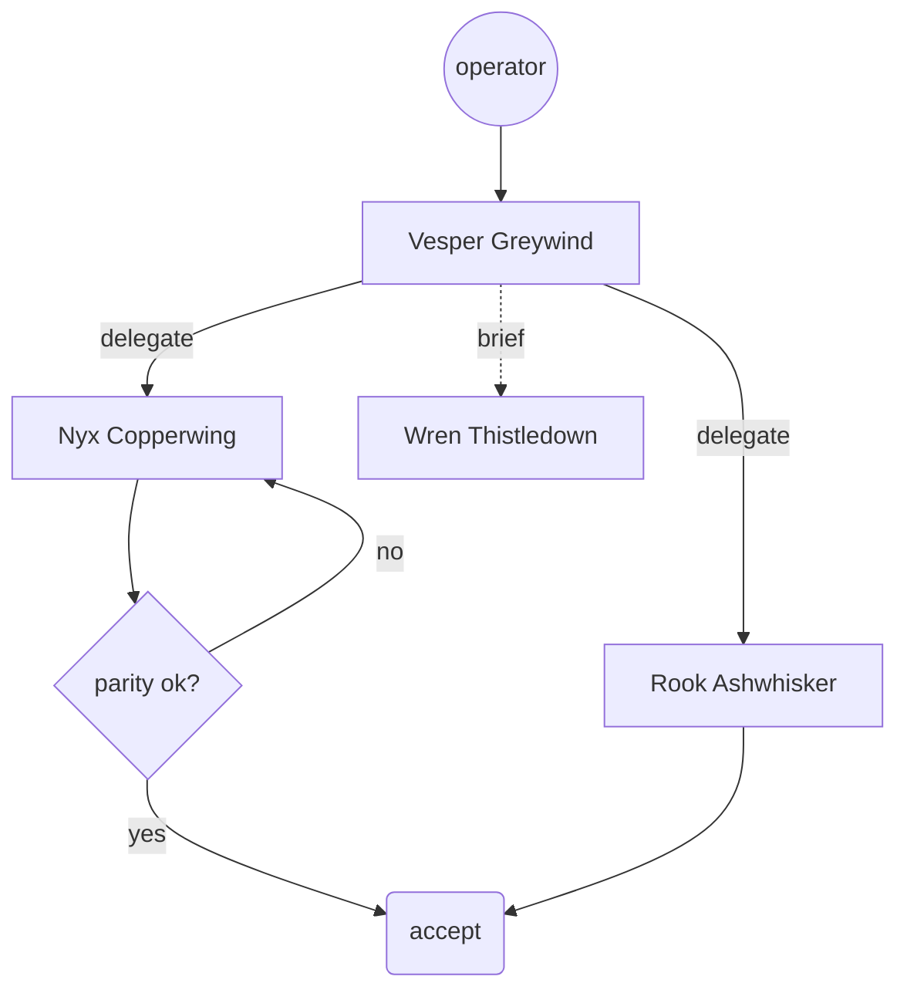

```mermaid
flowchart TD
  op((operator)):::accent --> V[Vesper Greywind]:::oracle
  V -->|delegate| N[Nyx Copperwing]:::executor
  V -->|delegate| R[Rook Ashwhisker]:::executor
  V -.->|brief| W[Wren Thistledown]:::creativity
  N --> P{parity ok?}
  P -->|yes| A(accept)
  P -->|no| N
  R --> A
```
