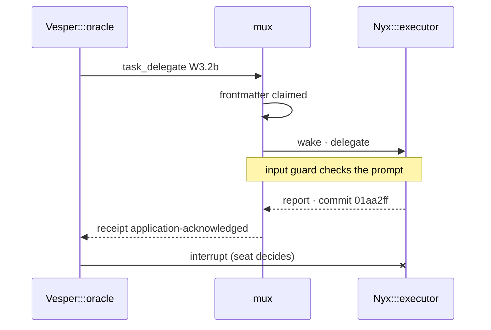

```mermaid
sequenceDiagram
  participant O as Vesper:::oracle
  participant M as mux
  participant N as Nyx:::executor
  O->>M: task_delegate W3.2b
  M->>M: frontmatter claimed
  M->>N: wake · delegate
  Note over M,N: input guard checks the prompt
  N-->>M: report · commit 01aa2ff
  M-->>O: receipt application-acknowledged
  O-x N: interrupt (seat decides)
```
