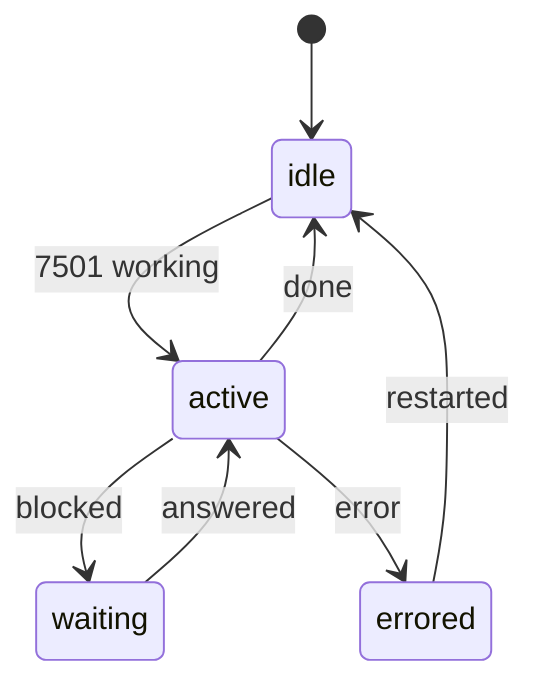

```mermaid
stateDiagram-v2
  [*] --> idle
  idle --> active: 7501 working
  active --> waiting: blocked
  waiting --> active: answered
  active --> idle: done
  active --> errored: error
  errored --> idle: restarted
```
